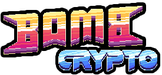

<!-- PROJECT SHIELDS -->
<!-- https://www.markdownguide.org/basic-syntax/#reference-style-links -->

<!-- PROJECT LOGO -->
 

  

<h3 align="center">Bomb Crypto Bot</h3>

  

    A bot created with pyautogui to play bomb crypto.
     
     
    <a href="#"><strong>Explore the docs »</strong></a>
     
     
    <a href="#">View Demo</a>
    ·
    <a href="#">Report Bug</a>
    ·
    <a href="#">Request Feature</a>
  

<!-- TABLE OF CONTENTS -->

  
Table of Contents

  <ol>
    <li>
      <a href="#about-the-project">About The Project</a>
      <ul>
        <li><a href="#built-with">Built With</a></li>
      </ul>
    </li>
    <li>
      <a href="#getting-started">Getting Started</a>
      <ul>
        <li><a href="#prerequisites">Prerequisites</a></li>
        <li><a href="#installation">Installation</a></li>
      </ul>
    </li>
    <li><a href="#usage">Usage</a></li>
    <li><a href="#roadmap">Roadmap</a></li>
    <li><a href="#contributing">Contributing</a></li>
    <li><a href="#license">License</a></li>
    <li><a href="#contact">Contact</a></li>
    <li><a href="#acknowledgments">Acknowledgments</a></li>
  </ol>

<!-- ABOUT THE PROJECT -->

## About The Project

Bomb Crypto Bot is a Python-based bot that automates playing Bomb Crypto using the PyAutoGUI library. The bot identifies button positions on the screen, records them, and automates gameplay to enhance your experience and efficiency in Bomb Crypto.

(<a href="#top">back to top</a>)

### Built With

- [Python](https://www.python.org)
- [PyAutoGUI](https://pyautogui.readthedocs.io/en/latest/)
- [OpenCV](https://docs.opencv.org/4.x/d6/d00/tutorial_py_root.html)

(<a href="#top">back to top</a>)

<!-- USAGE EXAMPLES -->

## Usage

Use this space to show useful examples of how a project can be used. Additional screenshots, code examples and demos work well in this space. You may also link to more resources.

_For more examples, please refer to the [Documentation](https://example.com)_

(<a href="#top">back to top</a>)

<!-- ROADMAP -->

## Roadmap

Deprecated.

(<a href="#top">back to top</a>)

<!-- LICENSE -->

## License

Distributed under the MIT License. See `LICENSE.txt` for more information.

(<a href="#top">back to top</a>)

